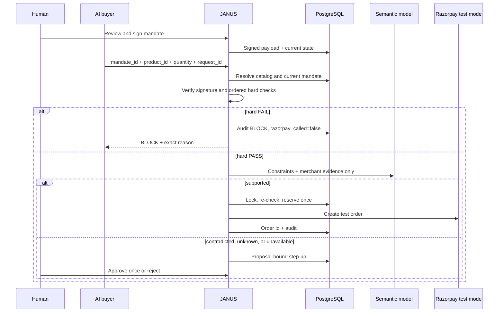

# JANUS Architecture

JANUS is a modular monolith: one FastAPI application, one React console, and one PostgreSQL database. Network integrations are narrow adapters; authorization stays in typed service logic.

## Transaction semantics

- `agent_request_id` is database-unique.
- Execution locks proposal and mandate rows and re-runs the hard gate against current state before reservation.
- Reservation commits before the external call. Once reserved, the mandate is consumed; uncertain Razorpay failure does not reopen authority.
- Revocation takes the same mandate lock. Revocation-first blocks; reservation-first may complete and future attempts are denied.
- The provider receipt is the JANUS proposal ID, giving a stable correlation key.

## Signed and mutable state

The signature covers instruction, hard constraints, semantic constraints, expiry, signed version, mandate ID, and execution limit. Status, current version, execution count, and revocation time are mutable online state. Current and signed versions are stored separately.

| Failure | Policy |
|---|---|
| Signature or hard policy | `BLOCK` |
| Database/authorization uncertainty | HTTP 500 fail-closed; no payment call |
| Model timeout, malformed output, missing credential | `STEP_UP` |
| Missing or hallucinated evidence field | `INSUFFICIENT_EVIDENCE` → `STEP_UP` |
| Razorpay error | Reservation stays consumed; proposal `FAILED`; audited provider-call failure |

